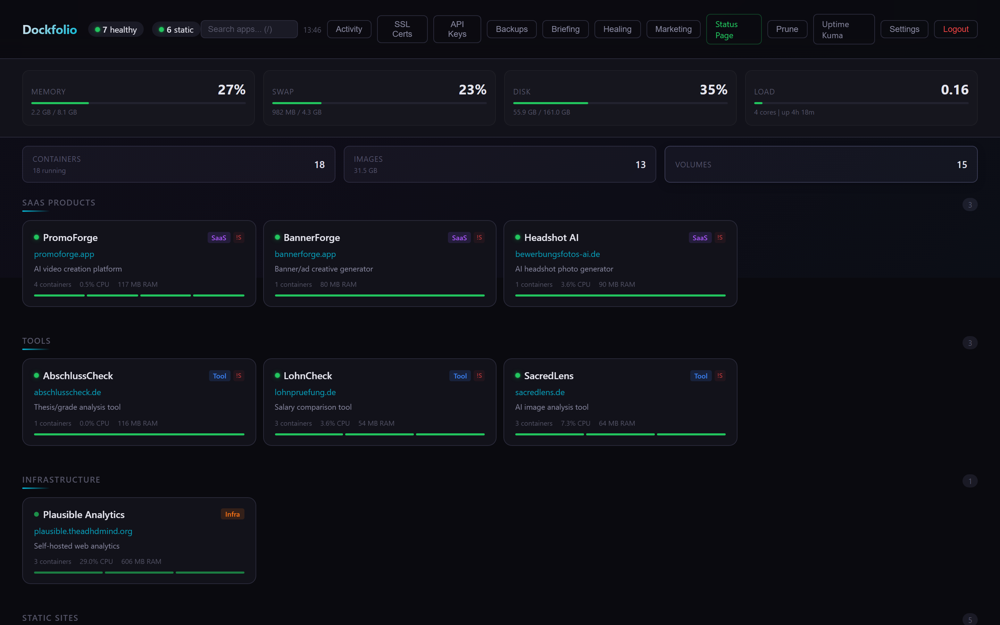
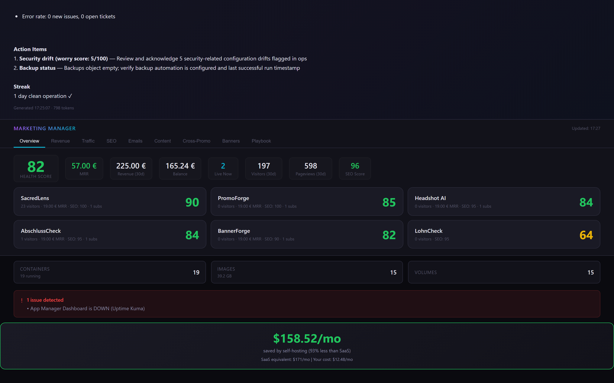
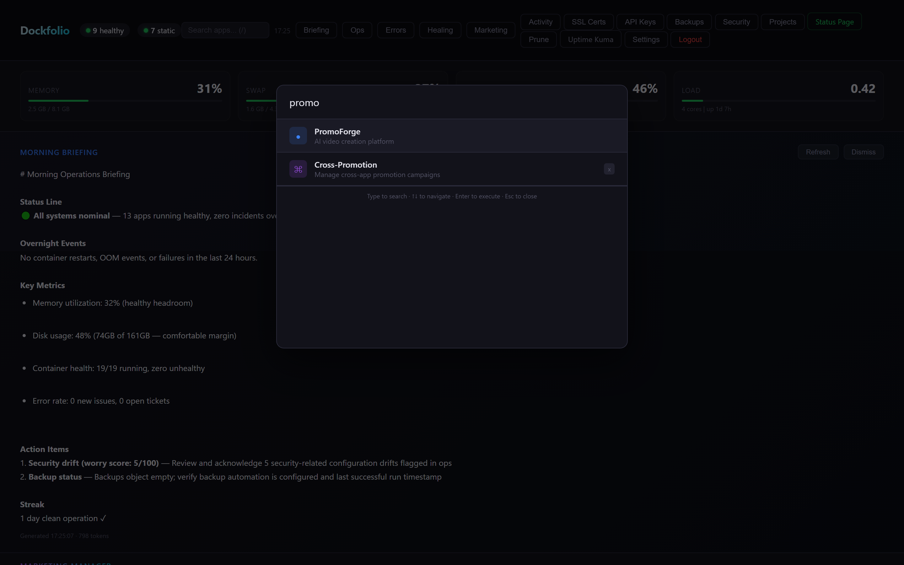
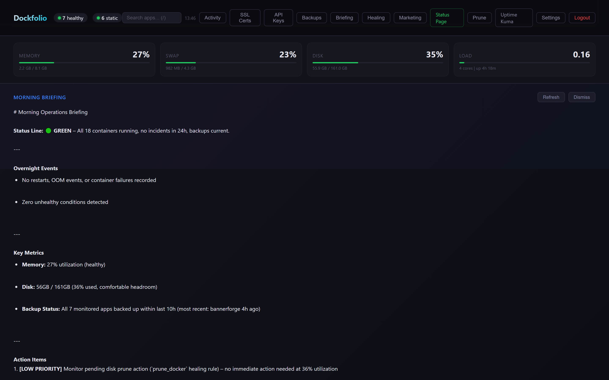
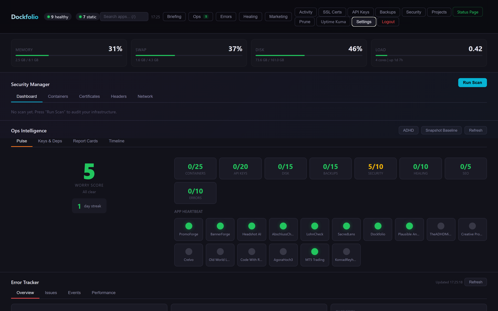

# Dockfolio

[](LICENSE)
[]()
[](https://github.com/dockfolio/dockfolio)

**The dashboard your Docker apps deserve.** Monitor containers, track revenue, audit security, heal infrastructure, and focus with ADHD mode. All from one keyboard-driven interface.

Unlike Portainer or Coolify, Dockfolio combines infrastructure management with business intelligence. Know how your apps are performing *as a business*, not just whether they're running. Built by a developer with ADHD, for developers who ship.

**[Website](https://dockfolio.dev)** | **[Install](#quick-start)** | **[Screenshots](#screenshots)**

## Screenshots


*System metrics, container status, and app cards organized by category*


*Portfolio health scores, MRR, revenue, traffic, SEO — per-app breakdown*


*Ctrl+K fuzzy search across apps, commands, and actions*


*AI-generated daily ops summary via Claude Haiku*


*Worry Score, app heartbeat, streak tracking, and component health breakdown*


*Security scanning with 0-100 scoring and A-F grades*

## Features

**Infrastructure**
- Docker container management (status, restart, logs, prune)
- System metrics (CPU, memory, disk, swap, load)
- SSL certificate monitoring
- Uptime monitoring (via Uptime Kuma integration)
- Auto-healing engine with playbooks (restart unhealthy containers, disk cleanup)

**Business Intelligence**
- Stripe revenue tracking (MRR, charges, cross-app analysis)
- Plausible traffic analytics integration
- SEO audit with scoring (13 checks, A-F grades)
- Portfolio health score
- Customer cohort analysis (cross-app customer matching)
- Cross-promotion campaign management with click tracking
- Banner/ad management (3 types, weighted rotation, embeddable script)

**AI-Powered Operations**
- Morning Briefing: AI-generated daily ops summary via Claude Haiku (~$0.001 per briefing)
- AI content pipeline for SEO (blog posts, comparison pages)
- AI Marketing Playbook: per-app strategy generation
- Command Palette (Ctrl+K): fuzzy search across apps, commands, and actions

**Error Tracking & Performance**
- Built-in error tracking (no Sentry needed)
- Docker log scanner (14 error patterns, 5-min cron)
- Docker event watcher (die/oom/health events)
- Sentry SDK envelope compatibility
- Browser error SDK (~30 lines, `window.onerror` + `unhandledrejection`)
- Performance metrics (p50/p95/p99 per endpoint)
- Error fingerprinting and auto-grouping

**Security Manager**
- 4 security scanners (container, SSL, headers, network)
- 0-100 scoring with A-F grades
- Security finding dismiss/acknowledge workflow
- Baseline drift detection

**ADHD-Friendly Design**
- ADHD Mode (Shift+A): Dims healthy items, kills animations, boosts contrast
- Focus Mode (Shift+Z): Single-app view, zero distractions
- Streak bar: Gamified uptime tracking
- Worry Score: One number (0-100) that tells you if you need to pay attention

**Developer Experience**
- Keyboard-first UX (21 shortcuts)
- Environment variable management with API key health checks
- Shared key detection across apps
- Dark theme, glassmorphic UI
- Built-in analytics (privacy-first, no cookies, replaces Plausible)
- Alert rules with custom thresholds and Telegram notifications
- GitHub webhook auto-deploy on push

## Quick Start

```bash
curl -fsSL https://raw.githubusercontent.com/dockfolio/dockfolio/master/install.sh | bash
```

Or manually:

```bash
mkdir dockfolio && cd dockfolio
curl -fsSL https://raw.githubusercontent.com/dockfolio/dockfolio/master/docker-compose.prod.yml -o docker-compose.yml
docker compose up -d
```

Open `http://your-server:9091` and create your admin account.

## Configuration

### Adding Apps

1. Open the dashboard and click **Settings**
2. Discovered Docker containers appear automatically
3. Click **+ Add** to start tracking a container group
4. Or add manually with name, domain, containers, and health endpoint

### Environment Variables

Create a `.env` file in your install directory:

```env
# Port (default: 9091)
APP_PORT=9091

# Telegram notifications for auto-healing alerts
TELEGRAM_BOT_TOKEN=your-bot-token
TELEGRAM_CHAT_ID=your-chat-id

# Plausible Analytics integration
PLAUSIBLE_URL=http://your-plausible:8000
PLAUSIBLE_API_KEY=your-api-key
```

### Integrations

| Integration | What it does | Required? |
|---|---|---|
| **Stripe** | Revenue tracking, MRR, customer cohorts | No, reads keys from your apps' .env files |
| **Plausible** | Traffic analytics, bounce rate, top pages | No, set PLAUSIBLE_URL and API key |
| **Anthropic** | AI morning briefings, content generation | No, reads key from your apps' .env files |
| **Resend** | Email sequence sending | No, reads key from your apps' .env files |
| **Telegram** | Auto-healing and system alert notifications | No, set bot token and chat ID |
| **BannerForge** | AI-generated promotional banners | No, optional for banner creation |
| **Uptime Kuma** | Uptime monitoring and status page | No, runs alongside as separate container |

## How It Compares

| Feature | Dockfolio | Coolify | Portainer | CapRover |
|---|:---:|:---:|:---:|:---:|
| Container management | Yes | Yes | Yes | Yes |
| Revenue tracking (Stripe) | **Yes** | No | No | No |
| Error tracking + perf metrics | **Yes** | No | No | No |
| Security scanning (A-F grades) | **Yes** | No | No | No |
| SEO monitoring | **Yes** | No | No | No |
| AI operations (briefings) | **Yes** | No | No | No |
| Auto-healing | **Yes** | No | No | No |
| Marketing automation | **Yes** | No | No | No |
| Built-in analytics | **Yes** | No | No | No |
| ADHD mode | **Yes** | No | No | No |
| Command palette (Ctrl+K) | **Yes** | No | No | No |
| Git deployments | No | Yes | No | Yes |
| Kubernetes support | No | No | Yes | No |
| Multi-server | Planned | Yes | Yes | Yes |

## Keyboard Shortcuts

| Key | Action |
|---|---|
| `Ctrl+K` or `?` | Command Palette |
| `d` | Morning Briefing |
| `h` | Auto-Healing panel |
| `m` | Marketing Manager |
| `b` | Backups |
| `k` | API Key Health |
| `s` | SSL Certificates |
| `a` | Activity Log |
| `r` | Refresh |
| `x` | Cross-Promotion tab |
| `Shift+B` | Banner Management tab |
| `p` | Marketing Playbook tab |
| `e` | Error Tracking panel |
| `Shift+A` | ADHD Mode |
| `Shift+Z` | Focus Mode (single app) |
| `Shift+S` | Security Manager |
| `o` | Ops Panel (Worry Score) |
| `j` | Projects / Kanban |
| `Escape` | Close panel / modal |
| `/` | Focus search |

## Architecture

Single-container Node.js app (~6,400 line backend, ~5,500 line frontend). SQLite for data persistence. No external dependencies required. Connects to your Docker socket and reads your apps' .env files for API keys. 124 tests (94 unit + 30 integration).

```
Dockfolio
├── Express API (144 endpoints)
├── Dockerode (container management)
├── SQLite (33 tables: auth, metrics, SEO, cohorts, emails, content, healing, banners, playbooks, errors, perf, analytics, alerts)
├── node-cron (28 scheduled jobs)
└── Vanilla JS SPA (keyboard-driven UI, 21 shortcuts, ADHD mode)
```

## Development

```bash
git clone https://github.com/dockfolio/dockfolio.git
cd dockfolio/dashboard
npm install
npm run dev
```

Requires Docker running locally for container management features.

## Known Limitations

- **Single server only**: multi-server support is planned but not yet implemented
- **Monolithic architecture**: single server.js and single index.html (by design — KISS)
- **No git deployments**: no push-to-deploy or webhook-based builds
- **No RBAC**: single admin user only, no team or role support

## License

AGPL-3.0. Free to use, self-host, and modify. If you offer it as a hosted service, you must open-source your changes.

## Contributing

Contributions welcome! Please read the codebase first. It's a monolith by design (KISS > architecture astronautics).

Areas where help is most wanted:
- Multi-server support (SSH-based remote Docker management)
- Git-based deployments (webhook → build → deploy)
- Frontend improvements (accessibility, mobile)
- Documentation and guides
- Integration with more services (Umami, PostHog, Stripe alternatives)
